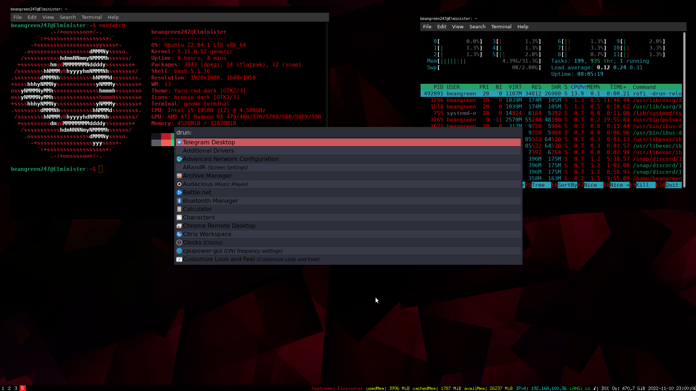

# My i3 config



Add repos and install packages
```
sudo add-apt-repository ppa:kgilmer/speed-ricer
sudo add-apt-repository ppa:aguignard/ppa                                                                       
sudo apt update
sudo apt install -y i3 i3blocks i3status xfce4-power-manager compton make
```
Next run these commands
```
sudo apt install libxcb1-dev libxcb-keysyms1-dev libpango1.0-dev libxcb-util0-dev libxcb-icccm4-dev libyajl-dev libstartup-notification0-dev libxcb-randr0-dev libev-dev libxcb-cursor-dev libxcb-xinerama0-dev libxcb-xkb-dev libxkbcommon-dev libxkbcommon-x11-dev autoconf xutils-dev libtool automake libxcb-shape0-dev
git clone https://www.github.com/Airblader/i3 i3-gaps                                                           
cd i3-gaps                                                                                                      
git checkout gaps && git pull                                                                                   
autoreconf --force --install                                                                                    
rm -rf build                                                                                                    
mkdir build                                                                                                     
cd build                                                                                                        
../configure --prefix=/usr --sysconfdir=/etc --disable-sanitizers                                               
make
git clone --recursive https://github.com/Airblader/xcb-util-xrm.git                                             
cd xcb-util-xrm/                                                                                                                            
rm -rf build                                                                                                    
mkdir build                                                                                                     
cd build                                                                                                        
../configure --prefix=/usr --sysconfdir=/etc --disable-sanitizers                                               
make                                                                                                            
sudo make install
cd ..
cd ..
cd build                                                                                                        
../configure --prefix=/usr --sysconfdir=/etc --disable-sanitizers                                               
make
sudo make install
```
Next download the config files
```
sudo wget -O .config/i3/config https://raw.githubusercontent.com/BeanGreen247/My-i3-config/master/i3-config/i3/config
sudo wget -O .config/i3/i3status.conf https://raw.githubusercontent.com/BeanGreen247/My-i3-config/master/i3-config/i3/i3status.conf
```
Lastly create the i3-volume folder to add volume files
```
mkdir i3-volume
wget -O i3-volume/volume-notifications.png https://raw.githubusercontent.com/BeanGreen247/My-i3-config/master/i3-volume/volume-notifications.png
wget -O i3-volume/volume https://raw.githubusercontent.com/BeanGreen247/My-i3-config/master/i3-volume/volume
```
That is it. Enjoy
